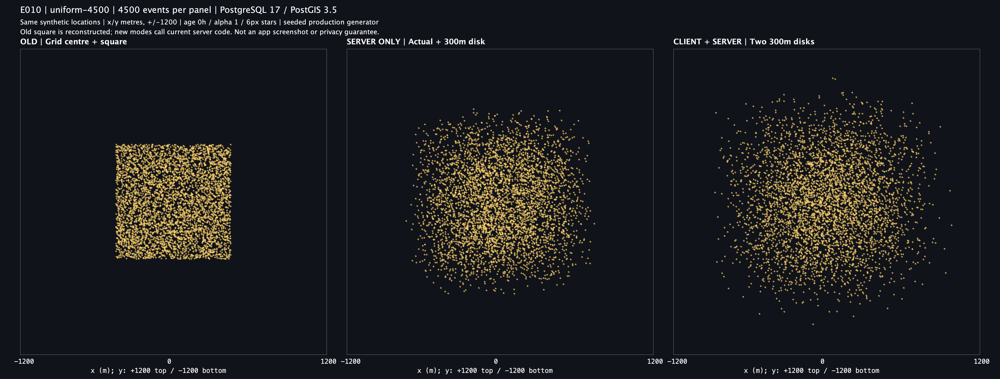

# 지도 별 위치 생성 방식의 최종 비교 근거

[ADR-0006](../adr/0006-use-independent-uniform-disks-for-sigh-location.md)의 선택을 확인할 수 있도록 실제 서버 생성기와 PostGIS로 만든 최종 그림·수치를 정리했어요. 전체 실험 코드·데이터를 서버 PR에 포함하지 않아도 선택의 근거와 한계를 읽을 수 있게 해요.

## 무엇을 비교했나요?

모든 그림은 **왼쪽 기존 사각형 / 가운데 실제 위치 + 서버 원 / 오른쪽 클라이언트 원 + 서버 원**이에요. 선택한 제품 계약은 오른쪽이며 가운데는 실제 위치 전송을 허용하는 계약이 아니에요. 왼쪽은 이전 서비스에서 사용한 사각형 배치 방식이에요.

| 경로 | 클라이언트 입력 | 서버 계산 |
| --- | --- | --- |
| 기존 사각형 | 300m 격자 중심 | x/y 각각 [-150,150)m |
| 서버만 원 | 합성 실제 위치 | 반경 300m 면적 균등 원 |
| 클라이언트·서버 원 | 실제 위치 주변 300m 원에서 고른 근사 좌표 | 독립적인 반경 300m 면적 균등 원 |

## 결과 그림

동일한 합성 위치와 대응 난수로 생성했어요. 모든 축은 원점 기준 ±1200m, 별은 같은 6px·투명도 1이에요. 실제 지도 타일·앱 화면은 아니에요.

단일 장소 5,000개: 이중 원은 사각형·단일 원보다 외곽 밀도가 완만해져요. 대신 더 넓게 퍼져요.

여러 밀집 장소 4,500개: 격자 셀 경계는 완화되지만 밀집과 빈 곳 자체가 없어지는 것은 아니에요.

균등 사각 영역 4,500개: 입력 자체가 사각 영역에 분포하므로 큰 윤곽의 흔적은 남아요.

## 수치와 검증 범위

| 단일 장소 5,000개 | RMS 이동 거리(m) | 표본 최대 거리(m) | 실제 위치 기준 300m 초과율 |
| --- | ---: | ---: | ---: |
| 기존 사각형 | 194.49 | 357.76 | 4.88% |
| 서버만 원 | 210.97 | 300.00 | 0% |
| 클라이언트·서버 원 | 299.83 | 588.16 | 41.52% |

RMS 이동 거리는 거리를 제곱해 평균낸 뒤 제곱근을 취한 값으로, 멀리 이동한 점의 영향을 더 크게 반영해요. 단순 평균 거리와 달라요. 거리는 EPSG:5179 평면 기준이에요. 300.00m는 299.996741m의 반올림이에요. 세 모델의 이동 거리를 같게 맞춘 실험은 아니며 이중 원의 이론적 상한은 600m예요. 지표면·GPS 정확도나 형식적 프라이버시 보장을 뜻하지 않아요.

2026-09-07 서버 구현 `325f656`과 PostgreSQL 17.5·PostGIS 3.5.2로 실행했어요. 실행당 합성 이벤트 14,000개를 세 경로로 처리했고 두 번 합계 84,000행을 만들었어요. 새 서버 생성기는 총 56,000번 호출했어요. 두 실행의 CSV·지표·PNG 5파일 해시가 같고, 새 경로의 좌표는 앞서 실행한 수학 모델의 같은 입력·난수 결과와 0.0001m 이내에서 일치했어요. 별도 검증기로 좌표와 통계를 다시 계산해 확인했어요. 이 작은 허용 오차는 계산 결과 간 비교 기준이지 실제 위치 정확도가 아니에요.

이 결과는 보존 브랜치에서 실행한 증거예요. 이번 서버 PR용 분리에서 실험을 다시 실행한 것은 아니에요. 제품에는 SecureRandom을 사용하지만 실험에는 재현 난수를 주입했어요. HTTP 저장·조회 API, 실제 클라이언트, 45,000개 고밀도 장면, 시간 감쇠·색상·기기 성능은 이 실험의 검증 대상이 아니에요.

## 원본 보존과 재현

실험 번호는 프로젝트 기능명이나 공개 표준이 아니라 이 작업에서 자료를 구분하기 위해 붙인 식별자예요. `E009`는 수학 모델 비교, `E010`은 실제 서버 생성기·PostGIS 비교를 뜻해요. 본문 그림은 후자의 결과예요.

실험 원본은 보존 브랜치 `be/feat/241-별의-사각형-윤곽-완화`에서 확인해요. 아래는 이 브랜치가 원격에 게시된 뒤 사용하는 안내예요. 2026-09-07 분리 시점에는 로컬에만 보존했어요.

1. 작업 중인 변경사항을 먼저 안전하게 보관하고, `git fetch origin`으로 원격 브랜치 정보를 받아요.
2. IDE나 Git 도구에서 보존 브랜치로 전환해요. 로컬에 없다면 같은 이름의 `origin` 브랜치를 기준으로 체크아웃해요.
3. 저장소 루트 기준으로 아래 파일을 열어요. `BE` 폴더를 프로젝트 루트로 열었다면 앞의 `BE/`를 제외해요.

| 확인할 내용 | 파일 |
| --- | --- |
| 실제 서버 비교 실행 안내 | `BE/docs/experiments/e010-production-coordinates/README.md` |
| 결과 무결성 확인용 해시 | `BE/docs/experiments/e010-production-coordinates/results/2026-09-07/raw/checksums.sha256` |
| 이전 수학 모델 비교 결과 | `BE/docs/experiments/e009-location-pipeline/results/2026-09-07/README.md` |

실험 기준 커밋은 `862989def688545a09852a4659358d4df20147b4`예요. 브랜치에 후속 변경이 있다면 이 커밋 시점의 파일을 확인해요. 이전 후보 코드와 전체 자료는 같은 브랜치의 `BE/src/test/java/com/pheeeew/sigh/experiment/e001/`와 `BE/docs/experiments/`에 있어요.

서버 PR 브랜치에는 전체 실험 실행기와 입력이 없어요. 실험을 다시 실행하려면 보존 브랜치의 실행 안내를 따르고, 현재 제품 작업과 분리된 작업 디렉터리를 사용해요. 파일을 여는 것만으로 실험이 실행되지는 않아요.
