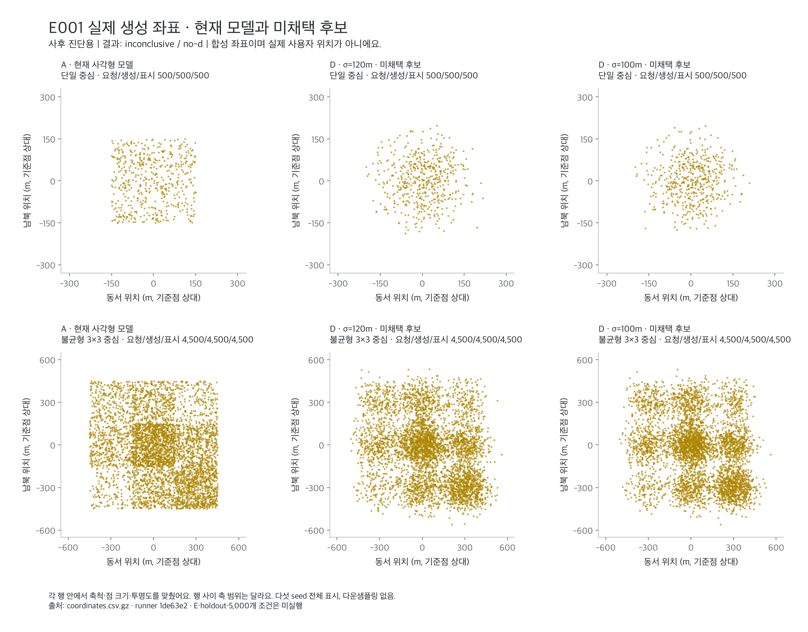

# E001-v1 실행 결과: 모델 선택 보류

2026-09-06 실제 분포 실행은 정상 종료했지만, 사전등록 판정은 **`inconclusive / no-d`**예요. 구현 모델을 채택하지 않아요. 두 D 후보가 경계 지표 gate를 통과하지 못해 E 생성 전에 종료했어요.

## 실행과 보존

- 실행: `./gradlew e001LocationDistribution --rerun-tasks --no-daemon` — `BUILD SUCCESSFUL`, 8초예요. 분포를 내부에서 두 번 생성했어요. 실행 성공과 모델 채택은 별개예요.
- protocol: `0a418b0c1f7f44dea5a4de86475776768a3872f8`, runner: `1de63e2e349f93cd516607c430cee5da1b604358`예요.
- 실행마다 요청·생성 15,000개, sampler 실패 0개예요. A·D σ120·D σ100마다 단일 중심 500개와 불균형 3×3 4,500개를 만들었어요. 두 실행을 합치면 30,000개지만, 보존된 공식 좌표 파일은 두 번째 실행의 15,000개예요.
- 원본은 [raw/manifest.json](raw/manifest.json), [좌표](raw/coordinates.csv.gz), [지표](raw/metrics.csv), [환경](raw/environment.json), [checksum](raw/checksums.sha256)에 보존했어요. 다섯 checksum 대상 파일 모두 `shasum -a 256 -c checksums.sha256` 검증을 통과했고, 첫 실행 checksum과 `cmp` 결과도 일치해요.
- checksum 목록 자체의 SHA-256은 `eb17ae8e0476a7344f59f4f27cc4e0acfb83f77a2c299025cb5cbf011f0b9daf`예요. 원본 파일은 결과 해석 과정에서 수정하지 않았어요.

JDK는 Eclipse Adoptium 21.0.5, Gradle 9.5.1, macOS 26.6.2 aarch64, CPU 수 10, 실행 당시 Git dirty는 false예요. 실제 사용자 좌표·운영 DB·네트워크를 실험 runner에서 사용하지 않았어요.

## 사전등록 gate 결과

아래 값은 단일 중심의 다섯 seed를 각각 계산한 뒤 요약한 값이에요. 각 seed에 100개씩 있어요.

| 지표 | 합격선 | D σ120 | D σ100 |
| --- | --- | ---: | ---: |
| 반경 p95의 median | ≤210m | 182.2733m | 177.1360m |
| 반경 p99의 median | ≤250m | 197.7759m | 189.8349m |
| seed별 p99의 최댓값 | ≤270m | 212.2379m | 206.0703m |
| edgeRatio30 median | ≤0.35 | 0.8947368 — 실패 | 0.8947368 — 실패 |
| edgeRatio30 최댓값 | ≤0.50 | 0.8947368 — 실패 | 0.8947368 — 실패 |

반경 gate는 모두 통과했고, 경계 gate가 `no-d`의 직접 원인이에요. B·C·E, confirmation, spectral, conformance 표본, 성능 측정과 블라인드 평가는 실행하지 않았어요. 단일 중심 5,000개와 실제 앱 지도 검증도 아직 하지 않았어요.

## 실패 원인: 빈 경계 띠와 보정식

원본 좌표의 offset에서 반경을 독립 재계산해 [seed별 띠 개수](diagnostic-edge-counts.csv)를 확인했어요.

- D σ100: 모든 seed에서 바깥 띠와 안쪽 띠가 모두 0개예요.
- D σ120: 바깥 띠는 모두 0개이고, 안쪽 띠는 첫 seed에 1개, 나머지 seed에 0개예요.
- 바깥 띠는 경계 거리 `0≤d<30`, 안쪽 띠는 `30≤d<60`이에요. 원형 support에서 각각 `270<r≤300`, `240<r≤270`에 해당하며, 생성 좌표는 `r<300`을 만족해요.

[프로토콜](../../README.md)의 양쪽 `+0.5` 보정식을 그대로 적용하면 두 띠가 모두 비었을 때도 다음 값이 나와요.

```text
edgeRatio30 = (0.5 / (π × 17100)) / (0.5 / (π × 15300))
            = 15300 / 17100
            ≈ 0.8947368421
```

이는 관측된 경계 밀도 차이가 아니라 **보정값과 면적비만으로 결정된 값**이에요. 구현과 등록식은 일치하며 독립 검토에서도 같은 원인을 확인했어요. 보정 상수만 작게 바꿔도 두 개수가 0이면 같은 면적비가 남아요.

따라서 이번 결과로 “D에 단단한 원형 경계가 생긴다”거나 “E가 A보다 나쁘다”고 결론 내릴 수 없어요. 희박한 꼬리 구간을 seed당 100개로 평가할 때 지표와 gate의 조합이 후보 선택을 막았다는 진단이에요. 표본을 늘리면 반드시 통과한다는 결론도 내리지 않아요.

## 실제 생성 좌표의 사후 진단 그림



현재 모델 A와 미채택 D 후보를 비교하는 **사후 진단용 산점도**예요. 확정된 변경 전후나 공식 블라인드 panel이 아니에요. 모든 15,000개 점을 표시했고 새 점을 생성하거나 다운샘플링하지 않았어요. 각 행에서 축 범위·종횡비·점 크기·투명도를 같게 했으며, 단일 중심과 여러 중심의 행 사이 축 범위는 달라요.

시각적 관찰로는 A의 직선 외곽과 D의 중심 밀집·흐려지는 외곽이 구분돼요. 여러 중심에서는 D에도 반복되는 밀집과 빈 공간이 남아 보여요. 이는 사람 다섯 명의 블라인드 평가나 자연스러움의 우월성 검증을 대신하지 않아요. 선택 절차가 종료된 뒤 그렸으며, 이미 본 이 그림을 사전 평가 자료로 취급해 재튜닝하지 않아요.

재현 스크립트는 [plot_e001_inconclusive.py](../../plot_e001_inconclusive.py)예요. 원본 checksum, 좌표 개수·중복·유한성·반경, 표시 범위와 seed 수를 먼저 검증해요. PNG는 Python 3.14 / Matplotlib 3.11.1 / Apple SD Gothic Neo로 생성했어요. 분석 전용 가상 환경을 `build/`에 두었으며 제품 의존성은 변경하지 않았어요.

```bash
# BE 디렉터리에서 실행해요. 출력은 새 디렉터리를 지정해요.
build/e001-analysis-venv/bin/python \
  docs/experiments/e001-map-star-location-distribution/plot_e001_inconclusive.py \
  docs/experiments/e001-map-star-location-distribution/results/2026-09-06-e001-v1/raw \
  build/e001-diagnostic-reproduction
```

## 다음 판단 지점

E001-v1의 표본·gate·보정식과 원본 결과는 유지해요. 곧바로 ADR 채택이나 운영 sampler 적용으로 넘어가지 않아요.

후속 승인에서는 **경계 표본이 부족할 때의 처리와 지표 설계부터 재검토**해요. 절대 꼬리 점유율, 최소 정보량 조건, 표본 설계 등 대안을 비교하고 새 프로토콜 버전으로 사전등록해야 해요. 이번 사후 분석을 같은 실험의 사전 근거로 바꾸거나 합격선을 소급 완화하지 않아요. 아직 후속 설계나 재실행을 승인·수행한 상태는 아니에요.
