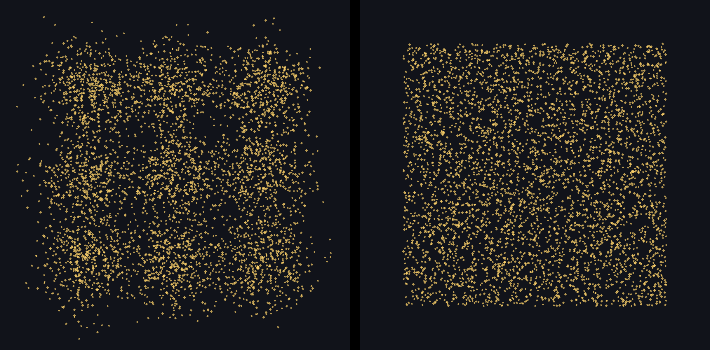
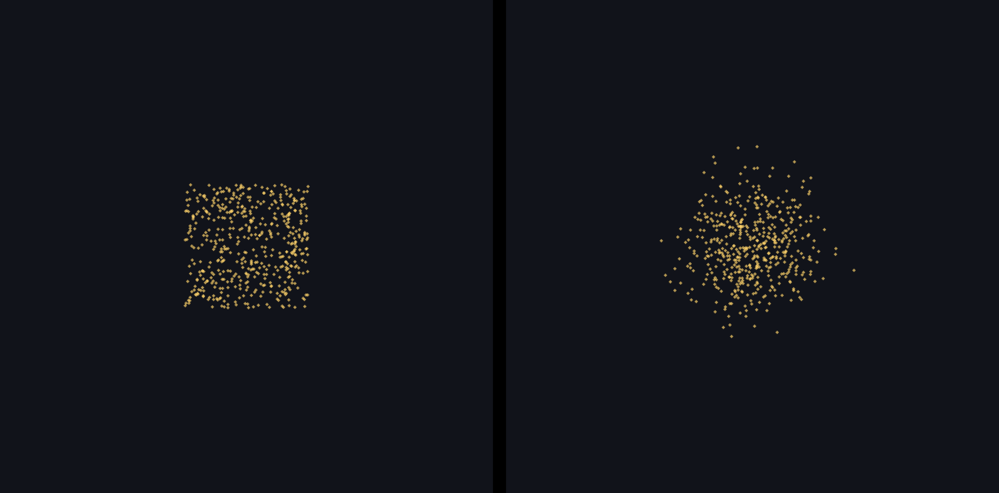
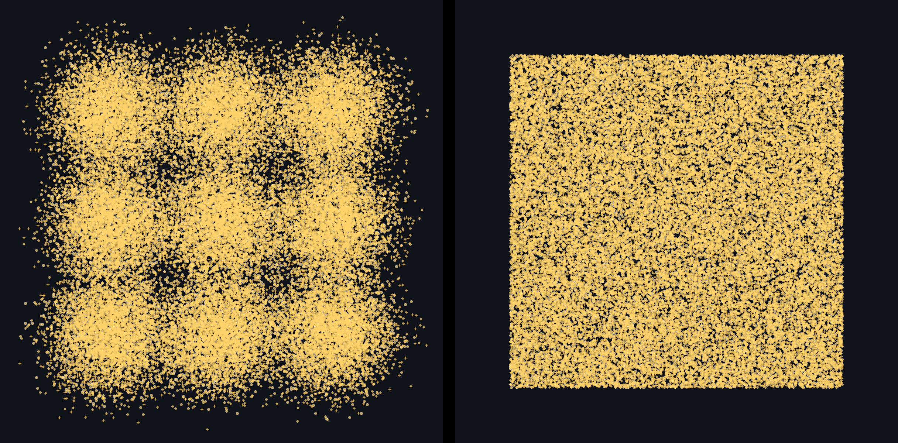
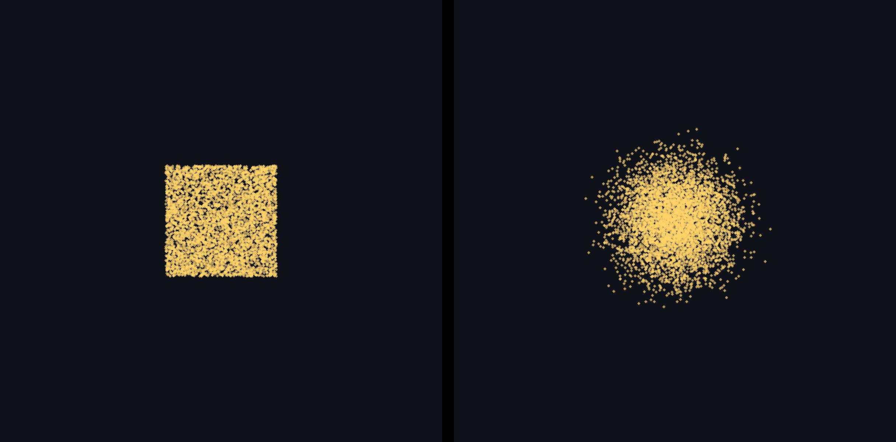

# 지도 별 분포 비교 — 평가자 안내

> 2026-09-07 후속 상태: 사용자 승인으로 이 batch의 모델이 공개됐어요. 아래는 공개 전 평가 안내 이력이에요. 그림·CSV 원본은 그대로지만 **이 package로 독립 블라인드 평가를 이어가지 않아요.**

네 화면을 보고 응답지의 빈칸을 채워 주세요. 각 화면의 좌우에는 **실제로 생성한 합성 좌표**를 같은 크기·축척·색·밝기로 표시했어요. 실제 사용자 위치나 지도 배경은 사용하지 않았어요.

## 응답 방법

1. 같은 다섯 명이 모두 네 화면을 평가해요. 제출 전에는 서로 의견을 나누지 않아요. 코드·결과 해설·원본 파일명이나 좌우 정답표는 열지 않아요.
2. [응답지](blind-ballot-template.csv)를 복사하고 `reviewer_id`에 본인에게 배정된 익명 ID를 네 행 모두 동일하게 적어요. 한 사람이 여러 ID로 응답하지 않아요.
3. 아래 세 질문에 답해요. 모든 화면에 응답하고 `status=valid`, 빈 `invalidation_reason`은 그대로 둬요.
4. 담당자에게 본인 CSV를 전달해요. 담당자가 다섯 명의 총 20행을 모아요. 누락·중복·잘못된 선택지는 정정한 뒤에만 판정해요.

| CSV 열 | 질문 | 입력값 |
| --- | --- | --- |
| `shape_choice` | 어느 쪽에서 사각형·원형·격자 모양이 덜 보여요? | `left` / `right` / `tie` |
| `natural_choice` | 어느 쪽이 더 자연스러운 군집과 빈 공간으로 보여요? | `left` / `right` / `tie` |
| `hotspot_choice` | 서비스에 부적절할 정도로 강한 hotspot이 있어요? | `left` / `right` / `both` / `neither` |

`hotspot`은 유난히 강하게 몰린 영역을 뜻해요. 좋아 보이는 쪽을 묻는 앞의 두 질문과 구분해서 답해 주세요. 이 문서에는 권장 응답이나 좌우 모델 이름을 표시하지 않아요.

## 화면 조건

원본 한 쌍은 2432×1200px이고, 가운데 32px 검은 간격을 제외한 각 화면은 1200×1200px예요. 각 화면은 동서·남북 1200m를 같은 축척(원본 1m/px)으로 보여줘요. 별 지름은 8px, opacity는 0.70이에요. 좌우를 같은 확대 비율로 봐 주세요. 격자선·중심점·모델 이름은 평가 조건에 따라 숨겼어요.

### 1. 3×3 중심 · 중심당 500개 · 각 화면 총 4,500개

응답지 pair ID: `047f13aad87b1321`

### 2. 단일 중심 · 각 화면 500개

응답지 pair ID: `0c695574696c5768`

### 3. 3×3 중심 · 중심당 5,000개 · 각 화면 총 45,000개

응답지 pair ID: `656ab089a201b687`

### 4. 단일 중심 · 각 화면 5,000개

응답지 pair ID: `71d7e3db3e9dee55`

## 자료의 범위

이미지 네 장과 두 CSV는 2026-09-07 생성한 공개 평가 package의 원본 복사본이에요. 이 안내 문서만 별도로 추가했어요. 새 좌표를 만들거나 그림을 다시 그리지 않았어요. 전체 다섯 명의 응답 전에는 모델 이름·좌우 배치·비공개 key를 공개하지 않아요. 노출 여부는 담당자에게 알려 주세요.
