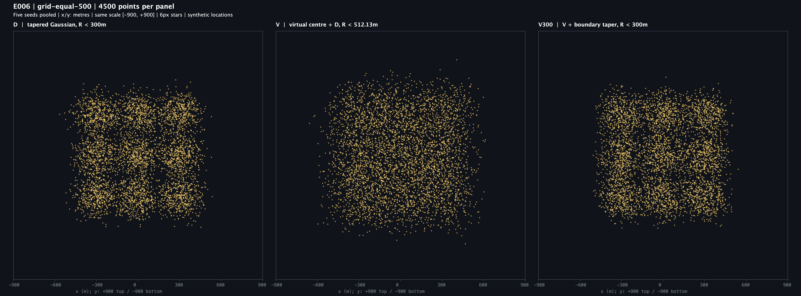
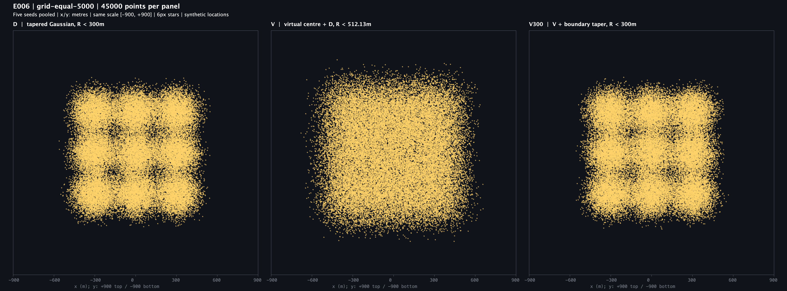
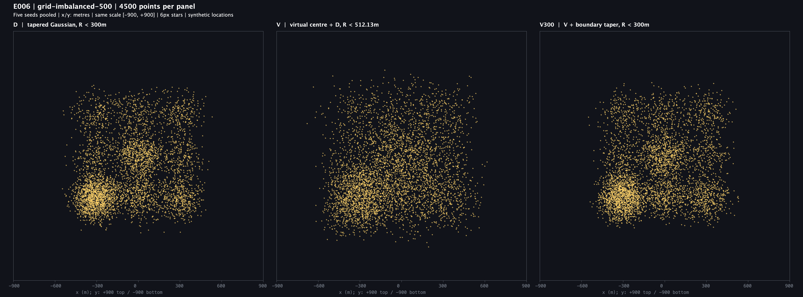
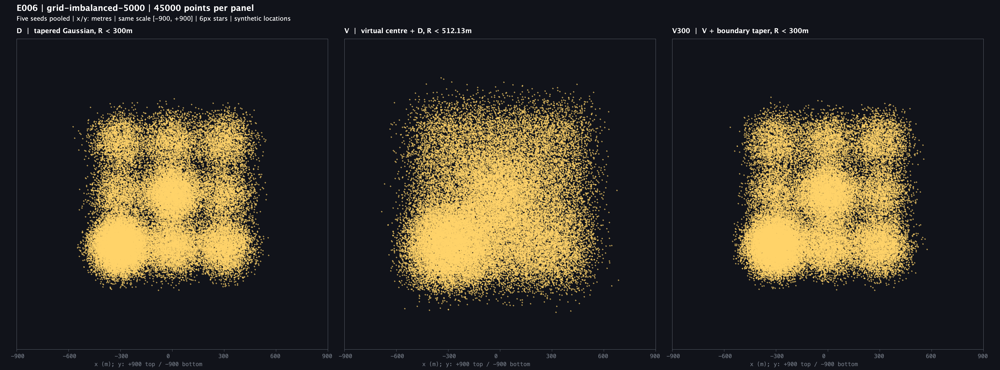
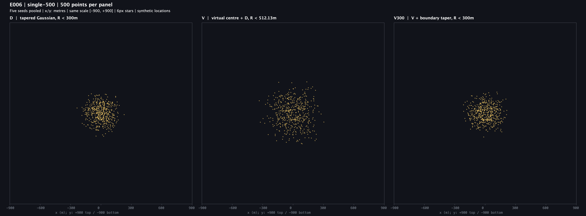
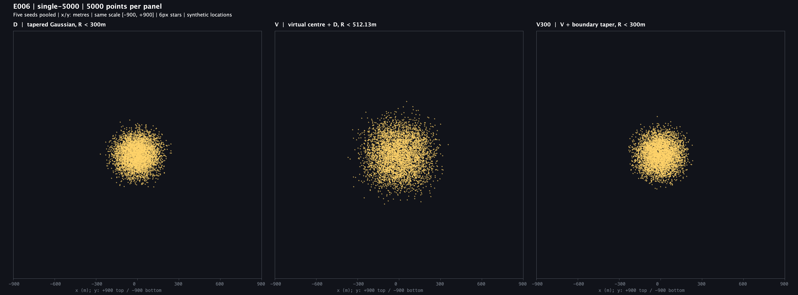

# E006 가상 중심 비교 실행 결과

2026-09-07 실행한 **비블라인드 탐색 실험**이에요. 기존 E001 원본·판정과 제품 코드는 변경하지 않았어요. E001 v2 결과는 `f3cdd00`으로 먼저 커밋했어요. 이번 E006은 실행 시점에 미커밋이에요.

## 그림 읽기

모든 그림은 **왼쪽 D / 가운데 V / 오른쪽 V300** 순서예요. 패널마다 같은 별 개수·축척·6px 별을 사용해요. 축은 실제 지도 좌표가 아닌 합성 상대 좌표(m)이며 범위는 x/y 각각 -900~900m예요. 한 그림은 seed 5개의 표본을 합친 결과예요.

| 모델 | 처리 | 원래 격자 중심 기준 |
| --- | --- | --- |
| D | 기존 σ=120m 가우시안에 부드러운 경계 감쇠를 적용해요. | 반경 300m 미만 |
| V | 매 별마다 격자 안의 가상 중심을 뽑고 D를 더해요. | 최대 약 512.13m 미만, 300m 제한 불충족 |
| V300 | V의 최종 좌표에 원래 중심 기준 경계 감쇠를 한 번 더 적용해요. 거절되면 가상 중심과 D 모두 다시 뽑아요. | 반경 300m 미만 |

### 9개 격자에 같은 수 — 총 4,500개

### 9개 격자에 같은 수 — 총 45,000개

### 9개 격자에 서로 다른 수 — 총 4,500개

### 9개 격자에 서로 다른 수 — 총 45,000개

### 한 격자 — 500개

### 한 격자 — 5,000개

## 수치 결과

원래 입력 격자 중심에서 최종 좌표까지의 거리예요. 표는 균등 9개 격자, 총 45,000개 pooled 결과를 반올림했어요. 전체 108행은 [metrics.csv](raw/metrics.csv)에 있어요.

| 지표 | D | V | V300 |
| --- | ---: | ---: | ---: |
| 95%의 별이 들어오는 반경 | 189.37m | 277.96m | 192.14m |
| 99%의 별이 들어오는 반경 | 224.42m | 328.05m | 225.51m |
| 관측 최대 반경 | 280.57m | 426.40m | 283.63m |
| 300m 이상 비율 | 0% | 2.6933% | 0% |
| 300m 주기 진폭 | 0.21127 | 0.00331 | 0.18979 |
| 별 하나당 평균 합산 후보 횟수 | 1 | 1 | 1.95391 |

300m 주기 진폭은 x·y축 `|mean(exp(i2π좌표/300))|`의 평균이에요. **작을수록 해당 간격의 반복 성분이 약하다는 뜻이지, 자연스러움 점수는 아니에요.** E001의 FFT grid300 지표와 다른 지표이며 합격선이나 유의성 검정이 없어요. 각도 `a4_raw`도 표본 오차를 보정하지 않은 진폭으로 E001의 보정 지표와 혼용하지 않아요.

V300의 이 진폭은 균등 45,000개에서 D보다 약 10.2% 작았어요. 불균형 45,000개에서도 D 0.21688, V 0.00474, V300 0.18190이었어요. 두 45,000개 조건 모두 seed별 5회에서도 V와 V300이 D보다 작았어요. 이는 선택한 조건의 반복 성분 관측이지 모집단 전체에 대한 통계적 확정은 아니에요.

합산 후보 횟수에는 내부 D sampler의 재추첨 횟수가 포함되지 않아요. CPU 시간이나 서비스 처리량으로 해석하지 않아요.

## 해석과 채택 상태

- **가상 중심은 300m 간격의 반복을 줄이는 데 효과가 있었어요.** 그림에서 V는 격자별 덩어리가 더 이어져 보이고, 수치에서도 반복 성분이 줄었어요. 다만 더 넓게 퍼지는 효과도 섞여 있어요.
- **300m 제한을 유지하는 V300은 D와 훨씬 비슷해졌어요.** 이번 경계 보정에서는 가상 중심 추가만으로 큰 개선이 보장되지 않았어요. 다른 모든 300m 제한 모델이 실패한다는 뜻은 아니에요.
- **전체 사각형 윤곽을 없앴다고 결론내리지 않아요.** 3×3 입력 중심 자체가 사각형으로 배치됐고 유한한 영역에 집중돼 있어요. V에서도 큰 외곽 모양이 남을 수 있어요. 별이 많으면 sprite 겹침도 판단에 영향을 줘요.
- V는 현재 작업의 원래 중심 기준 300m 제한을 위반하므로 그대로 제품 후보로 채택하지 않아요. D를 V300으로 교체하는 결정도 내리지 않았어요. 사람의 시각 선호 응답은 아직 수집하지 않았어요.

클라이언트는 기존처럼 격자 중심만 보냈다고 가정했어요. **실제 사용자 좌표에 클라이언트 잡음을 더하는 방식은 이번에 검증하지 않았어요.** 서버가 격자 내부 실제 사용자 분포를 복원하거나 위치 프라이버시를 추가로 보장한다는 뜻도 아니에요.

## 검증과 재현

실행 명령과 고정 조건은 [사전 비교 정의](../../README.md), 코드·환경은 [PROVENANCE.md](PROVENANCE.md)를 따라요.

- `./gradlew test --tests 'com.pheeeew.sigh.experiment.e001.E006VirtualCenterExperimentTest' --no-daemon`: **6개 통과, 실패·오류·건너뜀 0개**예요. D 보존, V 범위 초과 가능성, V300 재추첨·실패 처리, 결정성·지지영역, seed 식별을 검사했어요.
- 출처 고정 후 실행당 313,500개씩 두 번, **627,000개**를 생성했어요. 두 실행의 좌표 CSV·지표 CSV·PNG 6장, 총 8파일 checksum이 같았어요. sampler 실패와 화면 잘림은 0개예요.
- 별도 Ruby CSV 검증으로 313,500개의 식별자 유일성, 570개 중심별 그룹 수, 유한 좌표·반경·모델 범위·sprite 경계와 **108행의 모든 수치 지표**를 재계산했어요. 오차 허용 1e-9 안에서 일치했어요. PNG 6장은 모두 3856×1430px이며 직접 열어 제목·그림 잘림을 확인했어요.
- 실행 전·후 manifest 10항목이 모두 일치했어요. 최초 탐색 두 실행도 같은 8파일 checksum이어서 파라미터나 그림을 결과에 맞춰 바꾸지 않았어요. 독립 코드 리뷰의 출처 기록 지적은 선기록 후 새 출력 경로 재검증으로 보완했어요.

`raw/coordinates.csv.gz`는 재검증 run2의 전체 합성 좌표예요. `raw/checksums.sha256`과 `run1-checksums.sha256`, `verification.txt`, `source-before.sha256`을 함께 보존해요. 실제 앱·지도 배경·기기 성능·DB·줌·밝기 감쇠는 측정하지 않았어요.
