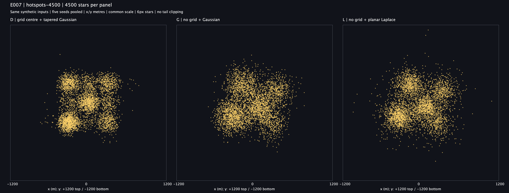
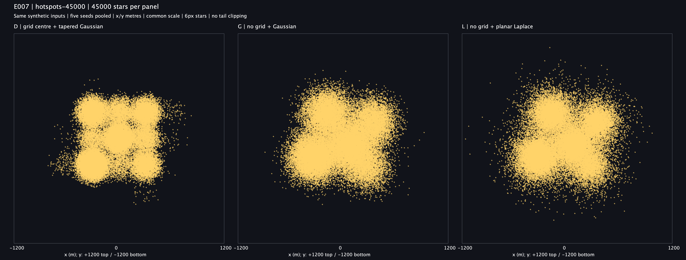
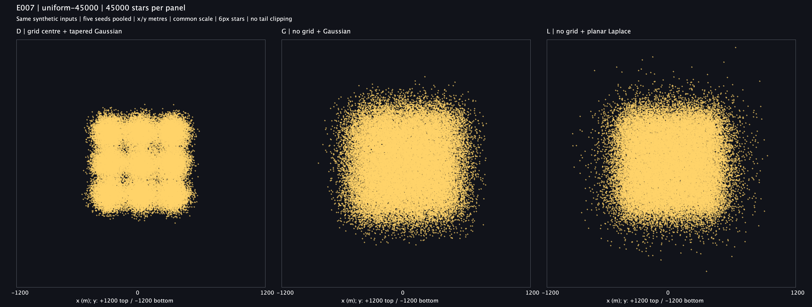
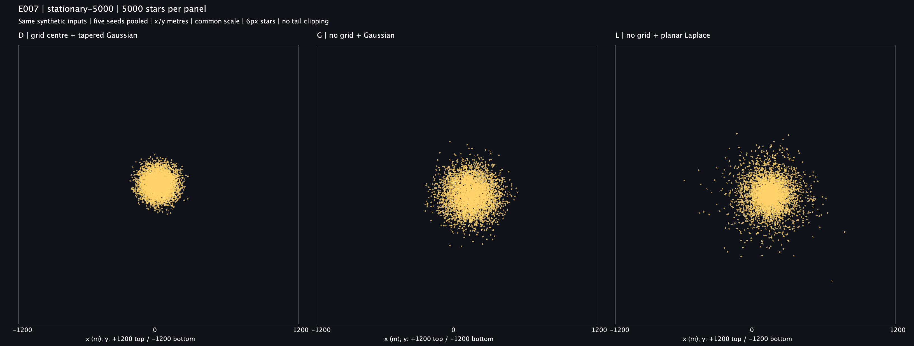
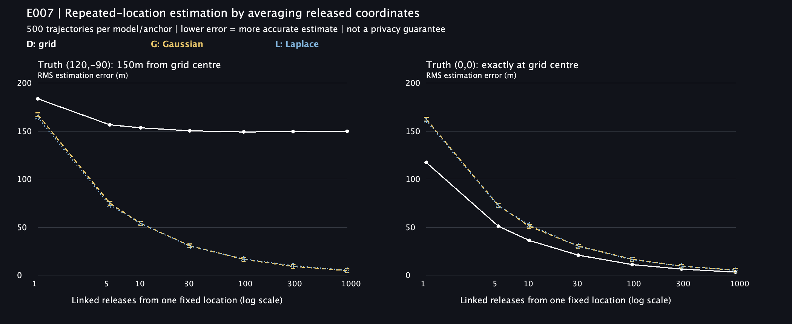

# E007 격자 없는 클라이언트 위치 비교 결과

2026-09-07 합성 데이터 탐색을 실행했어요. **격자 없는 G/L은 규칙적인 격자 덩어리를 줄였지만, 연결 가능한 반복 좌표의 평균으로 실제 위치에 접근할 수 있었어요.** 시각 개선과 위치 보호를 별개로 판단해야 해요. 제품·ADR·기존 E001/E006 결과는 변경하지 않았고 E007은 미커밋이에요.

## 비교 그림

왼쪽 **D: 격자 중심 + 기존 tapered Gaussian**, 가운데 **G: 실제 합성 위치 + Gaussian**, 오른쪽 **L: 실제 합성 위치 + planar Laplace**예요. G/L에는 서버 추가 잡음이나 300m 절단이 없어요. 같은 합성 입력을 공유하고 모든 산점도는 x/y ±1,200m, 6px 별, 동일 축척이에요. 범위는 사전에 정한 전체 최대 좌표 기반 규칙으로 정했으며 298,500개 표시 점 중 잘린 점은 0개예요.

### 불규칙한 다섯 장소 주변 — 4,500개



### 불규칙한 다섯 장소 주변 — 45,000개



### 사각 영역 전체에 균등한 실제 위치 — 45,000개



### 같은 위치 (120,-90) — 5,000개



시각적으로 G는 장소별 덩어리가 더 부드럽게 이어지고, L은 중심 부근의 밀집과 멀리 떨어진 점이 함께 나타나요. 이는 실행자의 시각 해석이고 사람의 선호 응답은 수집하지 않았어요. 45,000개에서는 별이 많이 겹쳐요. 균등 장면은 입력 자체가 사각 영역이므로 G/L에서도 큰 사각 외곽이 남을 수 있어요. 한 장소에 모인 별이 구름 형태를 이루는 것 자체가 사라지는 것은 아니에요.

## 거리 오차를 어떻게 맞췄나요?

**균등한 셀 내부 실제 위치를 기준으로 한 번 공개하는 RMS 거리 오차**를 166.7534m로 맞췄어요. RMS는 거리 제곱의 평균에 제곱근을 취한 값으로 단순 평균 거리와 달라요. D의 분산에 격자 양자화 오차가 포함돼 G의 σ와 직접 비교하지 않아요.

| 고정 값 | 결과 |
| --- | ---: |
| 기존 D kernel의 E[r²] | 12,806.707918m² |
| 격자 양자화의 평균 제곱 오차 | 15,000m² |
| 공통 target E[거리²] | 27,806.707918m² |
| G σ | 117.912484m |
| L b | 68.076805m |

Simpson 30,000구간 적분과 별도 Ruby 중점법 100,000구간 결과의 D m2 차이는 약 0.00000064m²였어요. L은 방사 대칭의 2차원 Laplace이고 x/y축에 따로 Laplace를 더하는 분포가 아니에요.

실제 위치에서 표시 위치까지의 **균등 45,000개** 결과예요. E006처럼 격자 중심에서의 거리가 아니에요.

| 지표 | D | G | L |
| --- | ---: | ---: | ---: |
| 실측 RMS 거리 오차 | 166.40m | 166.86m | 166.09m |
| 95% 포함 반경 | 276.32m | 289.94m | 322.16m |
| 99% 포함 반경 | 327.66m | 358.87m | 454.98m |
| 관측 최대 거리 | 431.98m | 532.99m | 906.81m |
| 실제 위치에서 300m 초과 | 2.547% | 4.089% | 6.489% |
| 300m 주기 진폭 | 0.21810 | 0.00425 | 0.00466 |

이 진폭은 x/y축 경험적 Fourier 진폭의 평균이고 E001 FFT 합격 지표나 자연스러움 점수가 아니에요. 작은 값은 해당 간격의 반복 성분이 약하다는 뜻이에요. 격자 제거와 noise 변경을 함께 비교하는 종단 간 모델 실험이며 둘 중 하나만의 인과 효과를 분리하지 않아요.

**장면마다 실제 오차가 같다고 주장하지 않아요.** 불규칙 장소 45,000개에서 D/G/L RMS는 161.85/166.75/166.31m, 단일 위치에서는 187.66/167.27/167.93m였어요. 셀 내부 위치에 따른 D의 오차 차이예요. 모든 72행 수치는 [metrics.csv](raw/metrics.csv)에 있어요. 최대 거리는 표본 최대일 뿐이고 G/L에는 이론적 300m 상한이 없어요.

## 같은 자리에서 반복 공개하면 어떻게 되나요?



공격자가 같은 장소의 좌표들을 연결해 평균 낼 수 있다는 가정이에요. 서로 독립인 500개 반복 경로 각각에서 1,000번까지 공개했어요. 그림에서 **아래로 갈수록 실제 위치를 더 정확히 추정**해요. 두 패널의 축은 같아요.

격자 중심에서 150m 떨어진 합성 실제 위치 (120,-90)의 결과예요. 값은 500개 반복의 추정 RMS 오차예요.

| 공개 횟수 | D | G | L |
| --- | ---: | ---: | ---: |
| 1회 | 183.90m | 167.27m | 164.19m |
| 100회 | 149.26m | 16.55m | 16.87m |
| 1,000회 | 150.11m | 5.06m | 5.28m |

100회에서 실제 위치 25m 이내로 추정된 경로는 G 90.4%, L 88.6%였어요. **라플라스도 반복 평균 추정을 막지 못했어요.** 동일한 단일 공개 MSE를 가진 G/L은 평균 추정 RMS 이론이 둘 다 √(target/n)이에요. D는 √(격자 잔차²+D kernel m2/n)이에요.

**D의 150m를 보장된 보호 거리로 읽으면 안 돼요.** 실제 위치가 격자 중심과 같은 (0,0)에서는 1,000회 후 D/G/L 추정 RMS가 3.43/5.48/5.12m였어요. 이는 해당 두 위치와 단순 평균 추정기의 오차이지, 모든 위치에서의 공격 성공률이나 모델의 전체 개인정보 보호 순위가 아니에요. 원본 42행은 [attack-metrics.csv](raw/attack-metrics.csv)에 있어요.

이상적인 연속 단일 공개 L의 geo-indistinguishability와 반복 공개 안전성은 달라요. 이 실행은 유한 정밀도, 보안 난수, 재식별·보조정보·연결 가능성, 반복 공개 예산 정책에 대한 형식 보장을 제공하지 않아요. 근거는 [원 모델](https://arxiv.org/html/1212.1984v3)과 [반복 공개 연구](https://arxiv.org/abs/1311.4008)를 참고해요.

## 결론과 다음 판단

격자 없는 입력은 시각 개선 후보로 남겨요. 그러나 매번 실제 위치 중심으로 독립 잡음을 넣는 방식은 반복 한숨의 위치 추정 위험을 함께 드러냈어요. **시각 선호만으로 G나 L을 제품에 채택하지 않았어요.** 300m 상한, 서버·다른 사용자가 좌표를 연결할 수 있는 범위, 반복 공개 정책을 별도 결정해야 해요. 기존 클라이언트 위치 계약·D의 팀 선택도 이번 실험으로 대체하지 않았어요.

## 실행·검증

- [고정 프로토콜](../../README.md)과 [실행 출처](PROVENANCE.md)를 따라요. 가까운 `E007ClientLocationExperimentTest`는 5개 통과, 실패·오류·건너뜀 0개예요.
- 두 실행 각각 표시 좌표 298,500개와 반복 공격 공개 3,000,000개를 생성했어요. 10파일의 checksum이 일치했고 실행 전후 source manifest 10항목도 같았어요.
- [독립 검증기](../../verify-results.rb)로 표시 좌표 298,500개의 식별자·공유 입력 99,500개·72행 지표, 반복 prefix 21,000행·42행 지표를 재계산했어요. 허용 절대 오차 1e-8 이내로 일치했어요. 그림 5장의 크기·범위와 실제 표시 상태도 확인했어요.
- 독립 코드 리뷰에서 수식·오차 통제·반복 공격 해석의 차단할 문제는 없었어요. 제품 테스트 전체·DB·실제 기기·지도 화면·성능 테스트는 범위 밖이라 실행하지 않았어요.

```bash
ruby docs/experiments/e007-client-location/verify-results.rb build/reports/experiments/e007-client-location
```

`raw/`는 run2 원본이에요. 재현용 전체 표시 좌표는 `coordinates.csv.gz`, 반복 공격은 각 경로의 checkpoint 평균을 `attack-prefixes.csv.gz`에 보존했어요. 300만 개 공격 공개 좌표 자체를 모두 저장하지는 않았고 고정 seed와 실행 코드로 재생성할 수 있어요. `run1-checksums.sha256`과 `verification.txt`도 함께 보존해요.
