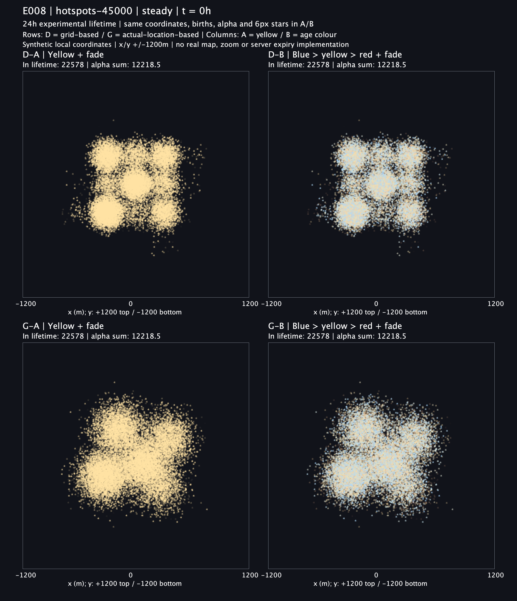
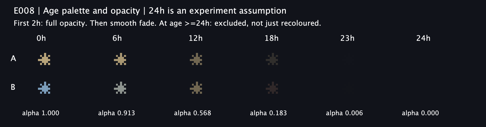
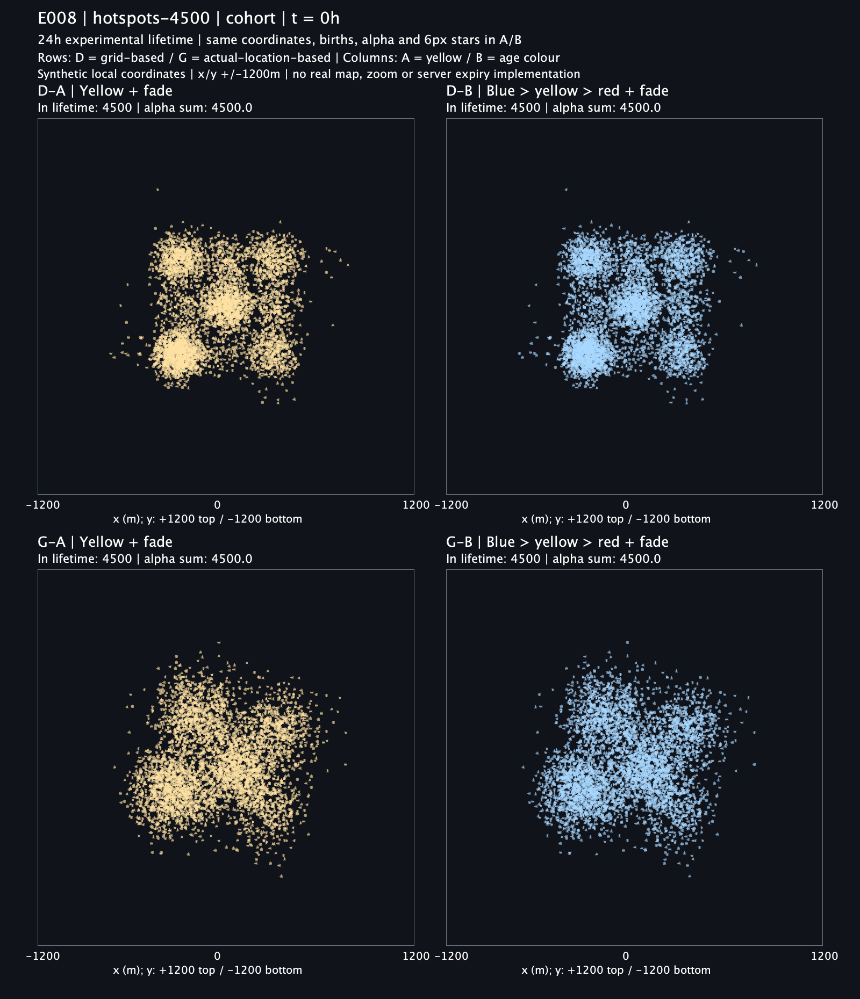
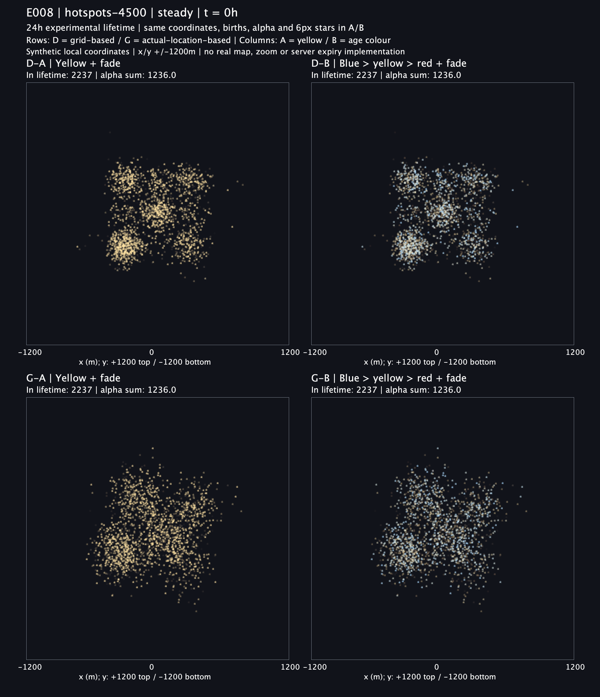

# E008 실행 결과: D/G × A/B 나이별 표현 비교

2026-09-07 실행을 완료했어요. **실험용 수명 24시간, 처음 2시간은 최대 밝기, 이후 부드러운 감쇠**를 적용했어요. 제품 코드·DB 조회·API·클라이언트는 변경하지 않았어요. 24시간은 제품 정책으로 채택한 값이 아니에요.

## 회의에서 먼저 볼 그림

| 위치 | 왼쪽 A: 노란색 + 감쇠 | 오른쪽 B: 파랑 → 노랑 → 붉은색 + 같은 감쇠 |
| --- | --- | --- |
| 위: D 격자 기반 | D-A | D-B |
| 아래: G 실제 위치 기반 | G-A | G-B |

D는 기존 사각형 균등 샘플러가 아니라 **300m 격자 중심 + 경계가 부드러운 가우시안(σ=120m, R=300m)**이에요. G는 합성 실제 위치 + 무경계 가우시안(σ=117.912484m)이에요. G를 제품에 도입하려면 클라이언트 계약 변경과 별도 프라이버시 검토가 필요해요.

A/B는 같은 최종 좌표·생성 시간·노출 대상·투명도·그리기 순서에서 **RGB만** 바꿨어요. D/G도 같은 합성 실제 위치·생성 시간을 공유하지만 표시 좌표는 각 모델에 따라 달라요. 모두 E007 좌표를 그대로 재사용했어요.

### 밀집 장소 4,500개, 지속 유입의 시작 시점

4,500개는 48시간 전체 이벤트 수예요. 아래 시점에서 수명 내에 있는 별은 패널별 2,237개예요.

### 밀집 장소 45,000개, 지속 유입의 시작 시점

이 시점의 수명 내 별은 패널별 22,578개예요. 24시간 만료와 감쇠를 적용해도 밀집 영역은 여전히 빽빽해요.

### 나이에 따른 색상과 투명도

범례의 별만 확대해서 보여줘요. 산점도의 별 크기는 모두 6px로 고정했어요.

## 시간 경과 비교

GIF는 0 → 6 → 12 → 18 → 24시간을 각각 1.2초씩 보여준 뒤 처음으로 돌아가요. 연속적인 앱 애니메이션은 아니에요. 색상은 양자화가 없는 원본 PNG를 기준으로 판단해요.

한 번에 생긴 별은 새 유입 없이 모두 늙고, 24시간에는 전부 제외돼요.

계속 생성되는 장면에서는 새로운 별과 만료되는 별이 교체돼요. 같은 별이 움직이거나 위치가 재추첨되는 것은 아니에요.

## 전체 그림

시간표는 전체 흐름을 보는 축소판이에요. 작은 글씨·색상·개별 별은 시점별 PNG에서 확인해요. 아래에 비교 화면 30장, 시간표 6장, GIF 6개를 모두 연결했어요. 위 범례 1장을 포함하면 PNG는 총 37장이에요.

| 입력 장면 | 시간 조건 | 움직이는 그림 | 시간표 | 시점별 원본 PNG |
| --- | --- | --- | --- | --- |
| 밀집 장소 · 4,500개 | 동시 생성 | [GIF](raw/hotspots-4500-cohort.gif) | [시간표](raw/hotspots-4500-cohort-timeline.png) | [0h](raw/hotspots-4500-cohort-h00.png) · [6h](raw/hotspots-4500-cohort-h06.png) · [12h](raw/hotspots-4500-cohort-h12.png) · [18h](raw/hotspots-4500-cohort-h18.png) · [24h](raw/hotspots-4500-cohort-h24.png) |
| 밀집 장소 · 4,500개 | 지속 유입 | [GIF](raw/hotspots-4500-steady.gif) | [시간표](raw/hotspots-4500-steady-timeline.png) | [0h](raw/hotspots-4500-steady-h00.png) · [6h](raw/hotspots-4500-steady-h06.png) · [12h](raw/hotspots-4500-steady-h12.png) · [18h](raw/hotspots-4500-steady-h18.png) · [24h](raw/hotspots-4500-steady-h24.png) |
| 밀집 장소 · 45,000개 | 동시 생성 | [GIF](raw/hotspots-45000-cohort.gif) | [시간표](raw/hotspots-45000-cohort-timeline.png) | [0h](raw/hotspots-45000-cohort-h00.png) · [6h](raw/hotspots-45000-cohort-h06.png) · [12h](raw/hotspots-45000-cohort-h12.png) · [18h](raw/hotspots-45000-cohort-h18.png) · [24h](raw/hotspots-45000-cohort-h24.png) |
| 밀집 장소 · 45,000개 | 지속 유입 | [GIF](raw/hotspots-45000-steady.gif) | [시간표](raw/hotspots-45000-steady-timeline.png) | [0h](raw/hotspots-45000-steady-h00.png) · [6h](raw/hotspots-45000-steady-h06.png) · [12h](raw/hotspots-45000-steady-h12.png) · [18h](raw/hotspots-45000-steady-h18.png) · [24h](raw/hotspots-45000-steady-h24.png) |
| 균등 입력 · 45,000개 | 동시 생성 | [GIF](raw/uniform-45000-cohort.gif) | [시간표](raw/uniform-45000-cohort-timeline.png) | [0h](raw/uniform-45000-cohort-h00.png) · [6h](raw/uniform-45000-cohort-h06.png) · [12h](raw/uniform-45000-cohort-h12.png) · [18h](raw/uniform-45000-cohort-h18.png) · [24h](raw/uniform-45000-cohort-h24.png) |
| 균등 입력 · 45,000개 | 지속 유입 | [GIF](raw/uniform-45000-steady.gif) | [시간표](raw/uniform-45000-steady-timeline.png) | [0h](raw/uniform-45000-steady-h00.png) · [6h](raw/uniform-45000-steady-h06.png) · [12h](raw/uniform-45000-steady-h12.png) · [18h](raw/uniform-45000-steady-h18.png) · [24h](raw/uniform-45000-steady-h24.png) |

## 측정 결과

아래는 hotspots-45000 조건이에요. 수명 내 개수와 평균 alpha는 D/G/A/B 모두 같아요. 수명 내라고 해서 흐린 별의 픽셀이 반드시 눈에 보이는 것은 아니에요.

| 조건 | 시점 | 수명 내 개수 | 평균 alpha |
| --- | ---: | ---: | ---: |
| 동시 생성 | 0h | 45,000 | 1.0000 |
| 동시 생성 | 12h | 45,000 | 0.5680 |
| 동시 생성 | 18h | 45,000 | 0.1826 |
| 동시 생성 | 24h | 0 | 0 |
| 지속 유입 | 0h | 22,578 | 0.5412 |
| 지속 유입 | 24h | 22,422 | 0.5376 |

원본 120행은 [metrics.csv](raw/metrics.csv)에 있어요. alpha 합은 투명도로 가중한 별 개수이며 **실제 화면 밝기·겹침량·렌더링 성능 지표는 아니에요**.

## 시각적 해석

- A는 노란색으로 통일되고 B는 젊은 별의 파란색이 상대적으로 두드러져요. B의 붉은 별은 수명 후반의 낮은 alpha와 겹쳐 잘 보이지 않아요. 오래된 별을 색으로 뚜렷하게 구분하려면 이후 별도 비교가 필요해요.
- 감쇠는 위치를 바꾸지 않으므로 D의 반복되는 밀집 영역을 없애지는 않아요. G도 입력 분포와 높은 밀도에서 큰 덩어리 윤곽이 남아요.
- 동시 생성 장면이 사라지는 것만으로 실제 서비스의 과밀 해결을 선언할 수 없어요. 지속 유입에서는 이 실험의 45,000개 중 약 22,500개가 계속 수명 안에 남아요.
- A/B의 alpha를 같게 맞췄지만 지각 밝기·휘도까지 같지는 않아요. 이번 비교는 최종 화면의 색상안 비교이며 순수한 색상 인지 실험은 아니에요.
- 사람의 선호 평가·승자 선정은 하지 않았어요. 기존 D 팀 선택이나 제품 계약을 변경하지 않아요.

## 검증과 한계

가까운 JUnit 테스트 4개가 통과했고 두 번 실행한 45개 산출물의 SHA-256이 모두 일치했어요. 실행 전후 소스·입력 6개 hash도 같아요. 별 좌표 189,000행 보존, 이벤트 94,500개의 D/G 생성 시간 공유, 통계 120행 재계산, 네 화면의 개수·alpha 일치, PNG 37장 크기와 GIF 6개의 5프레임·1.2초 간격을 확인했어요. 잘린 점은 0개이고 동시 생성 24h에는 전부 제외돼요. 동시 생성 12h에는 A/B가 같은 노란색에 도달하므로 실제 패널 내부 픽셀도 같아요.

6개 시간표와 대표 원본·범례를 직접 열어 배치와 시각 흐름을 검토했어요. 독립 코드 검토에서 blocker는 없었어요. 초기 테스트 컴파일에서 정적 birth 함수와 record 접근자 이름 충돌을 발견해 고쳤고, 수정된 코드에서 테스트와 실험을 실행했어요.

실제 지도·기기·MapLibre 화면이 아니라 Java2D 합성 좌표 평면이에요. 성능 측정, 줌별 크기, DB 조회 만료는 이번 검증 대상이 아니에요. 지속 유입은 생성 시간을 [-24,+24)h에 균등 배정한 고정 표본이지 실제 트래픽 예측이 아니에요. 좌표 프라이버시는 [E007 결과](../../../e007-client-location/results/2026-09-07/README.md)의 한계를 그대로 가져와요.

## 재현 자료

- [사전 고정 프로토콜](../../README.md)
- [실행 출처와 명령](PROVENANCE.md), [source-before.sha256](source-before.sha256)
- [실행 자체 검증](verification.txt), [최종 검증 기록](validation.txt)
- [run1 checksum](run1-checksums.sha256), [보존한 run2 checksum](raw/checksums.sha256)
- [고정 좌표·생성 시간 CSV](raw/stars.csv.gz), [독립 검증 스크립트](../../verify-results.rb)

E008은 미커밋 실험 결과예요. 기존 미커밋 E006/E007과 기존 제품 코드는 보존했어요.
