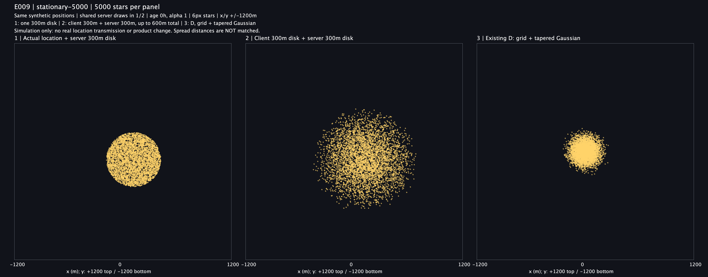
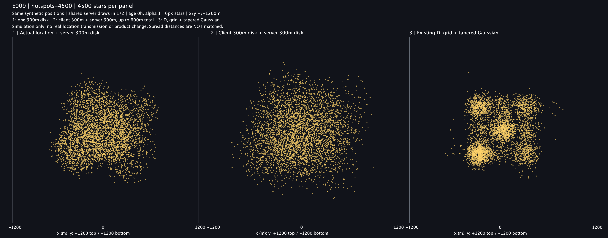
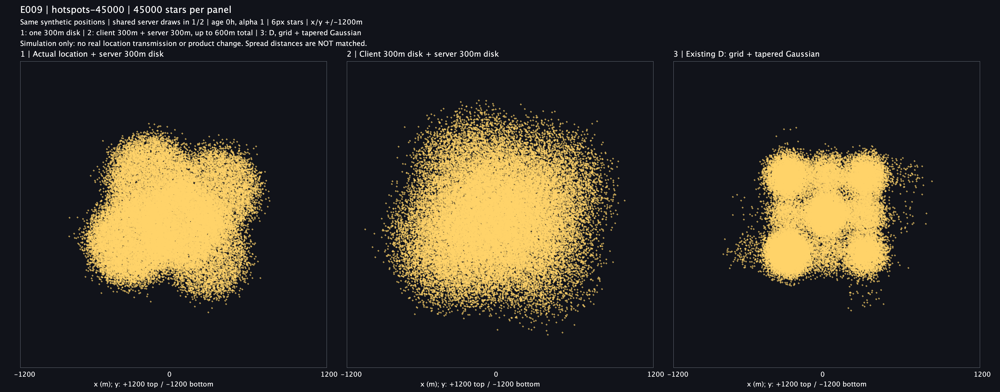
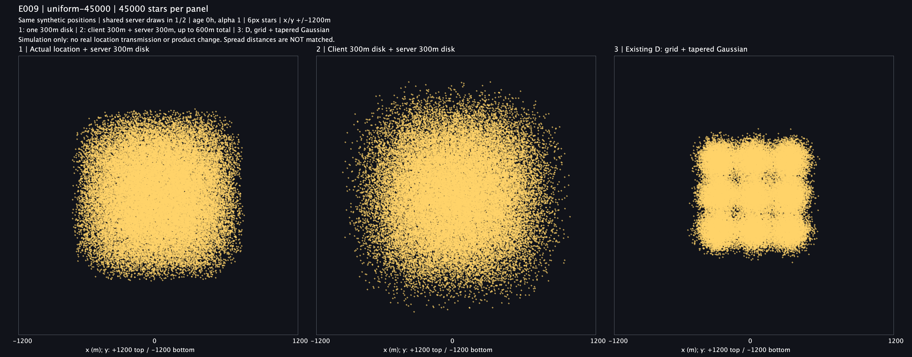

# E009 비교 결과: 서버 한 번 / 클라이언트와 서버 두 번 / 기존 D

2026-09-07 실제 합성 실험을 두 번 실행했어요. **2번은 클라이언트 랜덤 좌표를 서버가 그대로 저장하는 방식이 아니라, 받은 좌표 주변에서 다시 랜덤화하는 방식**이에요. 앞선 설명에서 다르게 이해했던 부분을 사용자 정정대로 바꿨어요.

## 그림 읽는 방법

| 위치 | 방식 | 실제 위치에서의 최대 이동 |
| --- | --- | --- |
| 왼쪽 1 | 실제 위치 전송 → 서버가 반경 300m 균등 원에서 선택 | 300m |
| 가운데 2 | 클라이언트가 반경 300m에서 선택 → 서버가 받은 좌표 주변 반경 300m에서 다시 선택 | 600m |
| 오른쪽 3 | 300m 격자 중심 전송 → 기존 D(σ120m, R300m tapered Gaussian) | 보수적 상한 약 512.1m |

**클라이언트의 첫 반경 300m는 이번 비교를 위한 가정**이에요. 사용자께서 지정한 서버 반경은 두 방식 모두 300m예요. 3번은 최근 비교했던 D이며 최초 사각형 균등 샘플러나 현재 배포 상태를 뜻하지 않아요.

같은 E007 실제 위치·격자·D 좌표를 재사용했어요. 1/2는 서버 이동 벡터가 같고, 2의 클라이언트 이동만 독립적으로 추가돼요. 모든 별은 같은 생성·관측 시각으로 나이 0h, alpha=1, 같은 금색·크기 6px예요. 모든 축은 ±1,200m로 고정했어요. E008에서 정한 실험용 24h 수명을 바꾼 것이 아니라 나이 효과를 고정한 위치 비교예요.

## 네 장면

### 한 장소에서 반복 생성 · 5,000개

### 여러 밀집 장소 · 4,500개

### 여러 밀집 장소 · 45,000개

### 균등하게 분포한 입력 · 45,000개

단일 장소의 합성 실제 위치는 (120,-90)m이고 D의 격자 중심은 (0,0)m예요. 그래서 D 덩어리의 중심이 왼쪽 두 그림과 달라요. 실제 사용자 GPS나 정확한 다섯 사람의 동선을 사용한 실험은 아니에요.

## 측정 결과

단일 장소 5,000개에서 실제 위치→최종 표시 위치의 거리예요.

| 방식 | 평균 거리 | RMS 거리 | 이번 표본의 최대 거리 | 300m 초과율 |
| --- | ---: | ---: | ---: | ---: |
| 1 서버 한 번 | 198.8m | 211.0m | 300.0m 미만 | 0% |
| 2 클라이언트 + 서버 | 271.5m | 299.8m | 588.2m | 41.52% |
| 3 기존 D | 172.9m | 187.7m | 420.5m | 4.38% |

표본의 최대 거리는 이론상 최대 거리와 달라요. 2번이 이번에는 588.2m까지 나왔어도 설계 상한은 600m예요. 3의 300m 초과는 격자 중심 기준 R300m 제한을 어긴 것이 아니에요.

균등 입력 45,000개에서는 RMS가 1=212.4m, 2=299.4m, 3=166.4m이고 300m 초과율은 각각 0%, 40.92%, 2.55%였어요. 모든 장면의 12행 원본은 [metrics.csv](raw/metrics.csv)에 있어요. RMS는 거리의 제곱평균제곱근으로 단순 평균 거리와 달라요.

## 무엇이 달라졌나요?

**1번은 같은 장소에서 반복하면 원판의 경계가 또렷해져요.** 여러 장소의 원이 겹치면 경계가 완화되지만, 한 곳에 몰리는 상황까지 해결되지는 않아요.

**2번은 원판보다 외곽 밀도가 부드럽게 줄어들어요.** 실제 위치 근처에 도착하는 두 이동의 조합은 많지만, 600m 근처에 도착하려면 두 이동 모두 길고 방향도 비슷해야 하기 때문이에요. 이것을 두 원 분포의 합성곱으로 설명할 수 있어요. 같은 방향의 두 최대 이동이 더해지므로 반경 300m 제한이 그대로 유지되지는 않아요.

**부드러움과 더 큰 분산이 동시에 생겨요.** 1의 이론 RMS는 300/√2≈212.1m, 2는 300m예요. 따라서 2가 더 드문드문 보이는 것을 전부 분포 모양 개선으로 돌릴 수 없어요. 공정한 동등 거리 비교나 프라이버시 우열 판정은 아니에요.

3은 단일 장소에서 작은 밀집 덩어리로 보이고, 여러 격자에서는 반복 패턴이 남아요. 높은 밀도의 장면에서는 1/2도 큰 덩어리로 채워지므로 과밀 해결이라고 결론내리지 않아요. 이 해석은 그림 검토 결과이며 사용자·팀의 선호 투표는 아직 없어요.

## 검증

사용자 정정 후 가까운 JUnit 테스트 **5개 통과**를 확인했어요. 기존 해석의 테스트 통과는 이 결과에 포함하지 않아요. 총 99,500개 이벤트에서 세 경로 298,500행을 실행당 생성했고, 두 번의 CSV·통계·PNG 6개 hash가 모두 같았어요. 실행 전후 소스·입력 6개 hash도 같았어요.

별도 Ruby 검증으로 입력 좌표와 D 결과 보존, 2번의 두 단계 반경 300m, 최종 600m 상한, 1/2의 서버 이동 벡터 일치, 12행 거리 통계를 대조했어요. 네 PNG를 직접 열어 제목·축·범위·잘림을 확인했어요. 잘린 점은 0개예요. 독립 에이전트 검토는 추가하지 않았고 자체 코드·결과 검토와 별도 계산 검증을 수행했어요.

## 한계와 다음 판단

이것은 Java2D 합성 좌표 실험이에요. 실제 클라이언트·서버 네트워크, 좌표계 변환, 재시도, DB 저장, 로그·메모리 보존, 배포용 난수, 위치 수집의 적법성은 검증하지 않았어요. 실제 위치를 수집하거나 제품 코드·정책·ADR을 바꾸지 않았어요. 랜덤화를 두 번 했다고 익명성이나 안전한 보호 반경이 보장되지는 않아요.

②의 첫 반경을 줄이면 총 이동 범위도 줄지만 이번 그림과 모양이 달라져요. 이 그림은 클라이언트 300m + 서버 300m 조건이며 해당 반경을 제품에 채택한 것은 아니에요.

## 재현 자료

- [실행 전 프로토콜](../../README.md), [출처·명령](PROVENANCE.md)
- [입력·소스 hash](source-before.sha256), [run1 hash](run1-checksums.sha256), [보존한 run2 hash](raw/checksums.sha256)
- [합성 좌표 CSV](raw/coordinates.csv.gz), [통계](raw/metrics.csv)
- [실행 자체 검증](verification.txt), [검증 기록](validation.txt), [독립 계산 검증](../../verify-results.rb)

E009 결과·그림 4장은 옵시디언의 지도 별 위치·표현 모델 폴더에도 기록해요. 기존 미커밋 E006/E007/E008은 보존했고 이번 작업도 커밋하지 않았어요.
