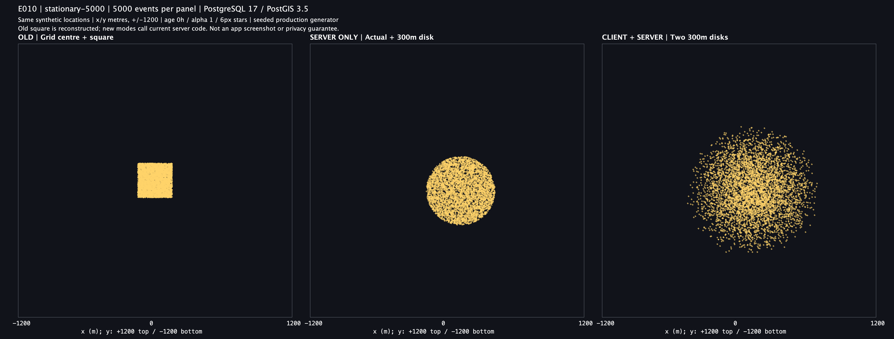
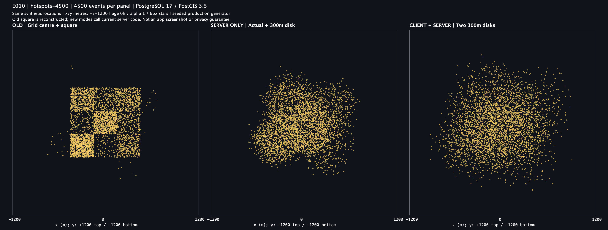

# E010 실제 서버 생성 좌표 비교 결과

2026-09-07 실행을 완료했어요. 서버 구현 커밋은 `325f656`이고 이 결과를 만든 실험 코드는 커밋 전 상태예요. 정확한 실행 소스는 [source-before.sha256](source-before.sha256) 10항목으로 식별해요. 기존 E001~E009는 변경하지 않았어요.

## 결과

실제 `PostgisSighLocationGenerator`와 PostgreSQL 17.5·PostGIS 3.5.2를 사용했어요. 새 서버의 단일 원·이중 원 좌표 28,000개/실행은 E009의 같은 이벤트 좌표와 모두 **0.0001m 이내**에서 일치했어요. 관측 최대 차이는 약 `4.44×10⁻⁹m`였으며 이는 계산 결과 간 일치도이지 실제 GPS·지표면 위치 정확도가 아니에요.

각 실행에서 동일한 합성 이벤트 14,000개를 세 경로로 처리해 42,000행을 만들었어요. 두 번 합계 84,000행이며 실제 새 서버 생성기는 총 56,000번 호출했어요. 두 실행의 CSV·지표·PNG 5파일 해시가 같았고 입력·소스 해시도 유지됐어요.

아래 숫자는 **합성 실제 위치에서 최종 표시 위치까지** EPSG:5179 평면 거리예요. 세 모델의 이동 거리를 같게 맞춘 실험은 아니에요.

| 장면 | 경로 | RMS 거리(m) | 표본 최대 거리(m) | 300m 초과율 |
| --- | --- | ---: | ---: | ---: |
| 단일 장소 5,000개 | 기존 사각형 | 194.49 | 357.76 | 4.88% |
| 단일 장소 5,000개 | 서버만 원 | 210.97 | 300.00 | 0% |
| 단일 장소 5,000개 | 클라이언트·서버 원 | 299.83 | 588.16 | 41.52% |
| 여러 밀집 장소 4,500개 | 기존 사각형 | 169.48 | 392.66 | 2.00% |
| 여러 밀집 장소 4,500개 | 서버만 원 | 211.49 | 299.96 | 0% |
| 여러 밀집 장소 4,500개 | 클라이언트·서버 원 | 300.35 | 584.36 | 41.27% |
| 균등 영역 4,500개 | 기존 사각형 | 172.83 | 380.81 | 2.49% |
| 균등 영역 4,500개 | 서버만 원 | 211.97 | 299.99 | 0% |
| 균등 영역 4,500개 | 클라이언트·서버 원 | 297.55 | 592.60 | 40.51% |

전체 정밀 수치는 [metrics.csv](raw/metrics.csv)에 있어요. `mode=0/1/2`는 이 문서의 왼쪽/가운데/오른쪽이고 E009의 번호와 달라요. mode 0의 `max_reference_error_m=0`은 E009 비교가 없는 경로의 표시값이에요. 단일 원 최대 거리 300.00은 반올림이며 원본은 299.996741m예요. uniform CSV의 `scene=uniform-45000`은 원본 장면 식별자로, 이번에 사용한 개수는 4,500개예요.

## 그림

모든 그림은 **왼쪽 기존 사각형 / 가운데 실제 위치+새 서버 원 / 오른쪽 클라이언트 원+새 서버 원**이에요. 가운데는 실제 위치 전송을 모의한 비교군이며 제품에서 실제 위치를 보내도록 허용한 것이 아니에요. 왼쪽은 이전 사각형 식을 재현한 것으로 가우시안 D가 아니에요.

### 단일 장소 5,000개



사각형과 단일 원은 경계가 뚜렷하고 이중 원은 외곽의 밀도가 완만해져요. 이중 원은 더 넓게 퍼지는 비용도 있어요.

### 여러 밀집 장소 4,500개



기존 셀 경계가 드러나는 모습과 비교해 새 경로에서는 장소 사이의 분포가 더 부드럽게 이어져요. 위치별 밀집과 빈 곳 자체가 없어지는 것은 아니에요.

### 균등 영역 4,500개


입력 위치 자체가 사각 영역에 분포해 큰 윤곽의 흔적은 남아요. 이번 변경은 격자 스냅과 날카로운 샘플링 경계를 완화하는 것이지 어떤 사용자 분포든 완전히 불규칙하게 만드는 것은 아니에요.

## 검증

```bash
./gradlew e010ProductionCoordinates --no-daemon
ruby docs/experiments/e010-production-coordinates/verify-results.rb build/reports/experiments/e010-production-coordinates
```

첫 명령은 `BUILD SUCCESSFUL in 54s`, 실험 테스트 1개 통과·실패/오류/건너뜀 0개예요. 두 번째 독립 검증도 PASS였어요. 단일 테스트 내부에서 두 번 전체 생성하고 좌표별 계약을 검증해요. 검증기는 입력 중복·다섯 seed별 인덱스 구성·42,000 출력 행·반경 경계·E009 일치·통계 9행·PNG 3장 크기·잘림 0을 다시 확인해요. 그림 3장을 직접 열어 축척과 라벨·잘림을 확인했어요.

원본은 [raw/](raw/), 실행 출처는 [PROVENANCE.md](PROVENANCE.md), 환경은 [environment.txt](environment.txt), 실행 판정은 [verification.txt](verification.txt)에 있어요. raw는 두 번째 실행 결과이고 첫 실행 manifest도 [별도 보존](run1-checksums.sha256)해요. 다른 환경에서는 폰트·Java2D 차이로 PNG 바이트가 다를 수 있어요.

## 이번 검증에 포함하지 않은 것

- 실제 앱·지도 타일·줌별 화면, 클라이언트 구현 완료, 구형 앱 전환·배포 승인이 아니에요.
- 배포용 보안 난수 대신 재현용 난수를 주입했어요. 실제 생성기와 공간 변환을 검증했지만 보안 난수 품질·운영 성능을 측정하지 않았어요.
- 저장·조회 HTTP API는 호출하지 않았어요. 기존 저장 좌표·멱등성은 서버 교체 시 통과한 81개 테스트와 구분해요. 이번 실행은 좌표 생성 경로를 검증해요.
- 실제 사용자 위치·운영 데이터, 45,000개 고밀도 장면, 시간 감쇠·만료·색상·과밀 해소·프라이버시 보장은 검증하지 않았어요.

서버 구현은 선택한 모양을 계산상 재현했어요. 클라이언트 변경과 PR 전 실제 앱 화면 확인은 여전히 남아 있어요.
